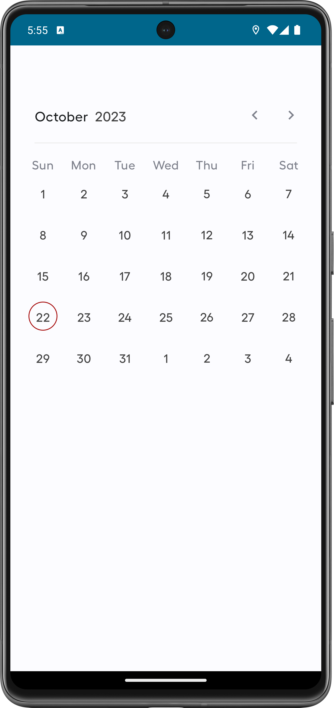
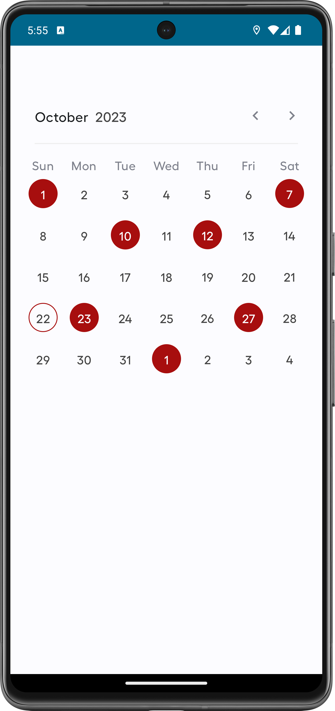

# MultiSelectCalendar
A multi-selectable calendar for jetpack compose. It always selection of multiple dates on calendar and is flexible dependent on ones usecase

[](https://jitpack.io/#Felix-Kariuki/MultiSelectCalendar)

## **Screenshots 📷**
| | |
|:-------------------------:|:-------------------------:|
| |  

## How to use
### 1. In your root `build.gradle` add: 

```gradle
allprojects {
    repositories {
        ...
        maven { url 'https://jitpack.io' }
    }
}
```

for `Kotlin DSL`
```gradle
repositories {
    ...
    maven { url = uri("https://www.jitpack.io" ) }
}
```

### 2. Then include this dependency in your app level `build.gradle` 

```gradle
dependencies {
 	 implementation("com.github.Felix-Kariuki.MultiSelectCalendar:multiSelectCalendar:v0.1.2")
}
```

In your composable where you intend to use
### Init multiselect state
 ``` kotlin

  val multiSelectState = rememberMultiSelectCalendarState()


```
allows you to control any prior dates you would like to mark as selected if need be 

``` kotlin


 val multiSelectState = rememberMultiSelectCalendarState(
        initialSelectedDates = emptyList() //initial selected dates
    )


```

### multiselect composable

``` kotlin

MultiSelectCalendar(
            calendarState = multiSelectState
        )


```

To get the list of selected dates 
 
``` kotlin

val dates = multiSelectState.selectedState.selected


```


## Demo 🎥


https://github.com/Felix-Kariuki/MultiSelectCalendar/assets/61313608/1c28c1be-9d1e-4e7f-bdfb-43b7abcfcb16


## Inspiration
Being in a situation where I had to select multple random dates I found it necessary to create a library that is more suited to my usecase and more customizable
There are multiple scenarios it can be used eg,
 - selecting multiple random dates(not range)
 - Blocking multiple dates while selecting others

## **Author**✍️
Felix Kariuki

<a href="https://www.buymeacoffee.com/felix.kariuki" target="_blank"></a>

Do Reach Out :

  * [Twitter](https://twitter.com/felixkariuki_)

  * [LinkedIn](https://www.linkedin.com/in/felix-kariuki/)
  
  
  ## License and Copyright ©️
  
  ```
    Copyright 2023 Felix Kariuki

    Licensed under the Apache License, Version 2.0 (the "License");
    you may not use this file except in compliance with the License.
    You may obtain a copy of the License at

       http://www.apache.org/licenses/LICENSE-2.0

    Unless required by applicable law or agreed to in writing, software
    distributed under the License is distributed on an "AS IS" BASIS,
    WITHOUT WARRANTIES OR CONDITIONS OF ANY KIND, either express or implied.
    See the License for the specific language governing permissions and
    limitations under the License.
  
  ```
